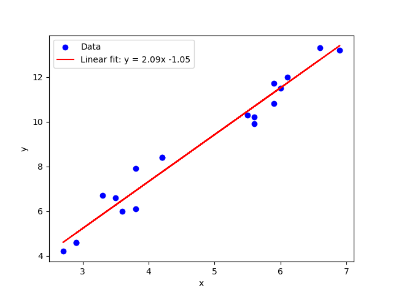
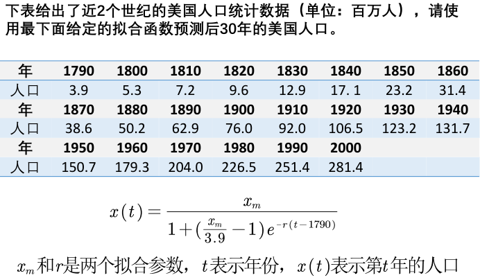
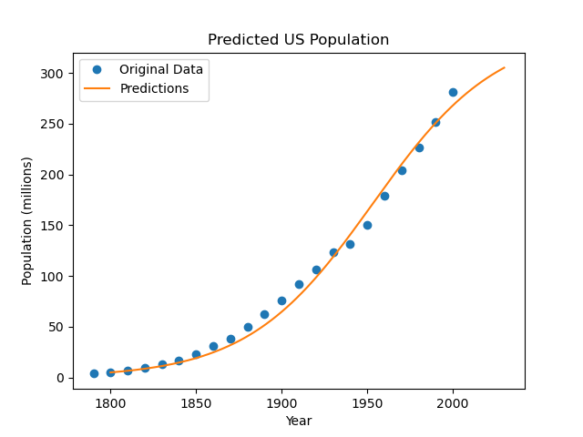

与插值算法不同，拟合问题中<u>不需要曲线一定经过给定的点</u>。拟合算法的目标是寻找一个函数，使得该曲线在某种准则下与所有的数据点最为接近，即曲线拟合得最好。（损失函数最小）。

拟合的思想：找到一条<u>确定的曲线</u>，尽管这条曲线不能经过每一个样本点，但是只要保证误差足够小即可。（插值算法中的分段法可能能够找到一条经过每个样本点而又不产生龙格现象的函数，但是这样的函数往往过于复杂。）

#### 最小二乘法的几何解释

假设有若干样本点$(x_i,y_i),i=1,2,\cdots,n$，我们设定的拟合曲线为$y=kx+b$，求$k$和$b$的取值使得样本点和拟合曲线最为接近：

- 第一种定义：$\hat{y_i} = kx_i+b$，其中$\hat{k}, \hat{b}= \underset{k,b}{arg\ min}(\sum\limits_{i=1}^{n}|y_i - \hat{y_i}|) $，这种定义存在不妥之处：有绝对值，不容易求导。计算比较复杂。

- 第二种定义：$\hat{y_i} = kx_i+b$，$\hat{k}, \hat{b}= \underset{k,b}{arg\ min}(\sum\limits_{i=1}^{n}|y_i - \hat{y_i}|)$，这其实也就是数理统计中所用到的最小二乘法。一是规避了绝对值的计算，二是二次方避免了正负抵消的情况。
  
  - tips：为什么不用奇数次方和四次方：奇数次方会导致误差正负相抵。而使用高偶次方会导致极端数据对拟合曲线的影响增大。最小二乘法得到的结果跟极大似然估计一致。

#### 最小二乘法的求解：

```python
import numpy as np
import matplotlib.pylot as plt

x = np.array([4.2, 5.9, 2.7, 3.8, 3.8, 5.6, 6.9, 3.5, 3.6, 2.9, 4.2, 6.1, 5.5, 6.6, 2.9, 3.3, 5.9, 6, 5.6])
y = np.array([8.4, 11.7, 4.2, 6.1, 7.9, 10.2, 13.2, 6.6, 6, 4.6, 8.4, 12, 10.3, 13.3, 4.6, 6.7, 10.8, 11.5, 9.9])

n = len(x)
k = (n * np.sum(x*y) - np.sum(x) * np.sum(y)) / (n * np.sum(x**2) - np.sum(x)**2)
b = (np.sum(y) - k * np.sum(x)) / n

y_pred = k * x + b

plt.scatter(x, y, color = 'blue', label = 'Data')
plt.plot(x, y_pred, color='red', label=f'Linear fit: y = {k:.2f}x {b:.2f}')
plt.xlabel('x')
plt.ylabel('y')
plt.legend()
plt.show()
```

得到：

#### 评价拟合结果的好坏

- 拟合优度$R^2$
  
  为了描述一个模型的预测值与实际观察值的匹配程度，引入了这个概念。
  
  在简单线性回归的情况下，拟合优度实际上是相关系数的平方。
  
  需要掌握的几个概念：
  
  - 总体平方和$SST$：衡量了因变量$y$的变异量，即所有数据点与$y$的均值的平方和，所反映的是$y$的总变异量，包括由模型解释的部分和未被模型解释的部分：$SST=\sum\limits_{i=1}^n(y_i-\bar{y})^2$。
  
  - 误差平方和$SSE$：衡量了模型预测值与实际观测值之间偏差的平方和。反映了模型无法解释的变异量，即数据的随机误差：$SSE=\sum\limits_{i=1}^n(y_i-\hat{y_i})^2$。
  
  - 回归平方和$SSR$：由于回归线的拟合而得到的$y$的变异量，即预测值与$y$的均值的偏差的平方和。反映了模型所解释的变异量：$SSR=\sum\limits_{i=1}^n(\hat{y_i}-\bar{y})^2$。
  
  ~~其实从名字上就可以看出~~$SST=SSE+SSR$。
  
  我们的拟合优度$ 0\leq R^2=\frac{SSR}{SST}=1-\frac{SSE}{SST} \leq 1$，$R^2$越接近1，说明误差平方和越接近0，误差越小则说明拟合的越好。
  
  - tips：$R^2$只能够用于拟合函数是线性函数时，拟合结果的评价。其他函数比较拟合的好坏。直接看$SSE$即可。

- "线性函数"的介绍
  
  这里的“线性函数”其实是对于参数而言为线性。（而不是对于变量，也成为线性于参数）。~~其实有点像是高中接触过的稍微复杂的回归方程。~~
  
  判断的方法：在函数中参数仅仅以一次方出现，且不能够乘以或除以其他任何的参数，并不能出现参数的复合函数形式。

- 计算"拟合优度"的代码
  
  ```python
  y_hat = k * x + b
  SSR = np.sum((y_hat - np.mean(y)) ** 2)
  SSE = np.sum((y_hat - y) ** 2)
  SST = np.sum((y - np.mean(y)) ** 2)
  R_2 = SSR / SST
  ```

#### 拟合工具使用案例


代码如下：

```python
import numpy as np
import matplotlib.pyplot as plt
from scipy.optimize import curve_fit

year = np.array(1790, 2010, 10)
population = np.array([3.9, 5.3, 7.2, 9.6, 12.9, 17.1, 23.2, 31.4, 38.6, 50.2,
                       62.9, 76.0, 92.0, 106.5, 123.2, 131.7, 150.7, 179.3, 204.0,
                       226.5, 251.4, 281.4])

def logistic_growth(t, xm, r):
    return xm / (1 + ((xm - population[0]) / population[0]) * np.exp(-r * (t - year[0])))

params, covariance = curve_fit(logistic_growth, year, population, p0=[500, 0.02], maxfev=10000)
xm, r = params

t = np.arange(1800, 2031)
predictions = logistic_growth(t, xm, r)

plt.figure(1)
plt.plot(year, population, 'o', label='Original Data')
plt.plot(t, predictions, label='Predictions')
plt.xlabel('Year')
plt.ylabel('Population (millions)')
plt.title('Predicted US Population')

plt.legend()
plt.show()
```
得到结果如下:
