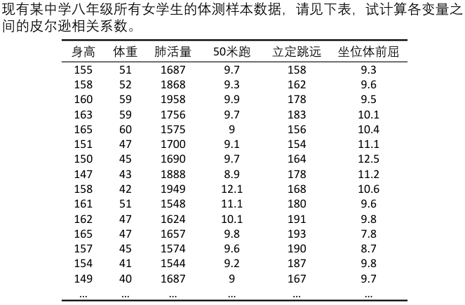
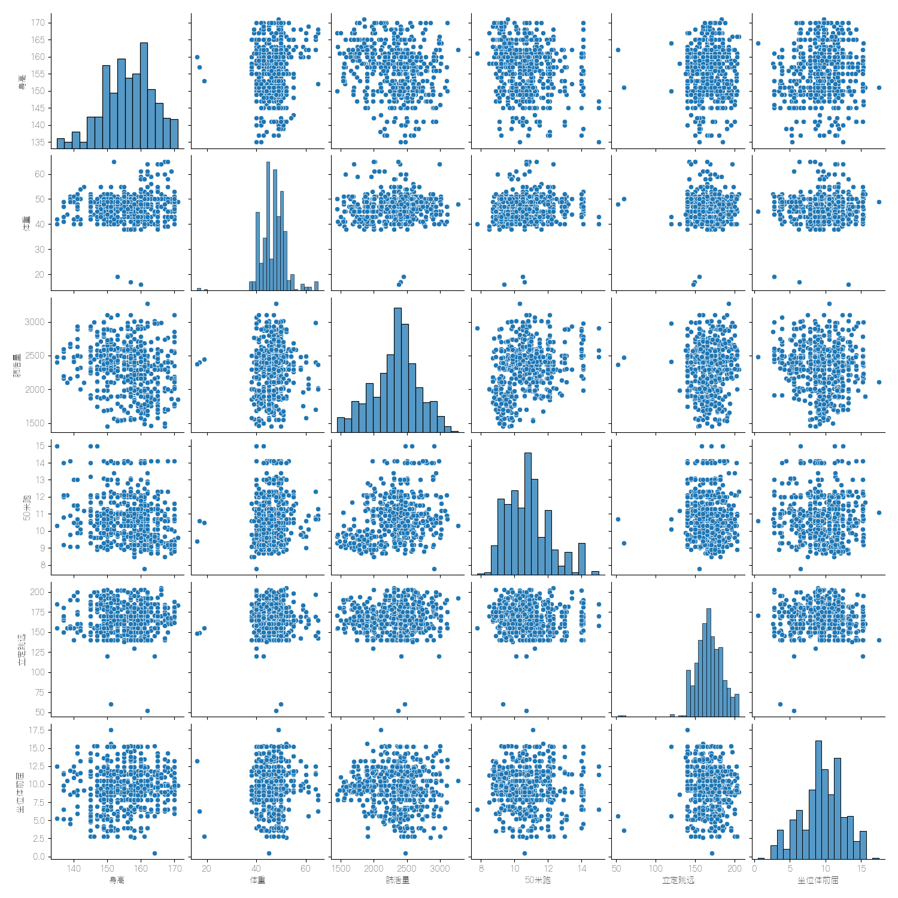
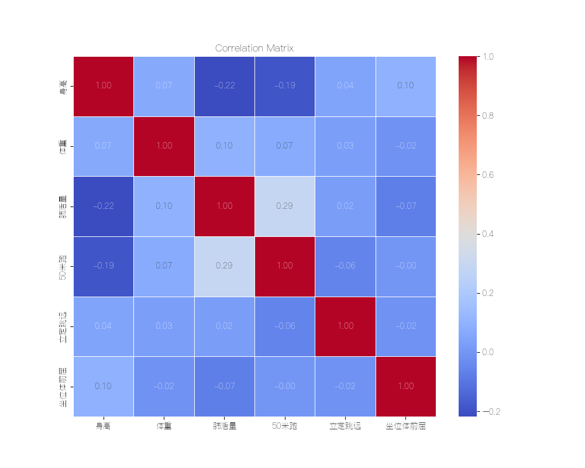
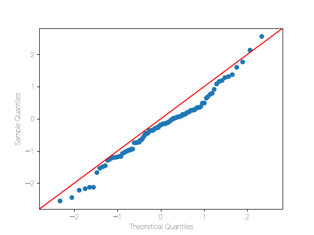
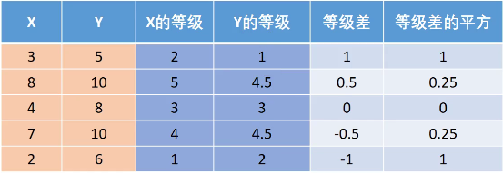

- 总体和样本
  
  - 总体：所要考察对象的全部个体。
  - 样本：从总体中所抽取的一部分个体叫做总体的一个样本。
  
  通常我们计算这些抽取的样本的统计量来估计总体的统计量。~~（概率论与数理统计）~~

#### 皮尔逊Pearson相关系数

- 相关系数：
  
  - 如果两组数据$X:\{X_1,X_2,\cdots,X_n \}$和$Y:\{Y_1,Y_2,\cdots,Y_n\}$是总体数据。那么总体均值为：$E(X)=\frac{\sum\limits_{i=1}^nX_i}{n},E(Y)=\frac{\sum\limits_{i=1}^nY_i}{n}$，总体协方差为：$Cov(X,Y)=\frac{\sum\limits_{i=1}^n(X_i-E(X))(Y_i-E(Y))}{n}$
  
  - 直观理解：当两个变量的变化方向相同（反）时，乘积为正（负），如果两者之间的变化无规律，那么在累积以后正负会抵消。
  
  - <u>协方差的大小和两个变量的量纲有关</u>，因此并不适合作比较，所以才要引入Pearson相关系数。

##### 总体相关系数

总体Pearson相关系数：$\rho_{XY}=\frac{Cov(X,Y)}{\sigma_X \sigma_Y}$，其中$\sigma_X 、\sigma_Y$分别为$X、Y$的标准差。

Pearson相关系数可以看成是消除了两个变量的量纲影响，即把$X、Y$标准化以后的协方差。

##### 样本相关系数

样本的协方差：

$Cov(X,Y)=\frac{\sum\limits_{i=1}^n(X_i-E(X))(Y_i-E(Y))}{n-1}$ ~~去翻翻概统课本就会知道为什么下面是n-1而不是n。~~

样本的相关系数为：$r_{XY}=\frac{Cov(X,Y)}{S_XS_Y}$，其中的$S_X$为样本标准差，和总体标准差也不一样的是，计算的时候分母也是$n-1$。

##### 相关性可视化

通过绘制散点图可以判定两个数据对象之间的相关性，而相关系数则是提供了一个具体的量化标准，<u>但是前提是必须要确认这两个变量是线性相关的</u>。

##### 需要注意的点：

- 非线性相关也能够导致线性相关系数很大，所以使用相关系数钱一定要确认为两个变量线性相关。

- 离群点对相关变量的影响很大。

- 如果两个变量的相关系数很大也不能说明两个变量相关，也有可能是由于异常值的影响。

- 相关系数计算为0只能够说明这两者不是线性相关。

##### 案例


使用python导入excel数据，然后使用相关的函数：

```python
import pandas as pd
import seaborn as sns
import matplotlib.pyplot as plt


file_path = './1.xlsx'
data = pd.read_excel(file_path)

correlation_matrix = data.corr()

plt.figure(figsize=(10, 8))
sns.heatmap(correlation_matrix, annot=True, cmap='coolwarm', linewidths=.5, fmt=".2f")
plt.title('Correlation Matrix')
plt.show()

sns.pairplot(data)
plt.show()
```

得到矩阵散点图：

以及在进行相关系数计算以后得到热力图：


##### 对Pearson相关系数进行假设检验

###### 传统检验方法：

- 提出原假设$H_0$和备选假设$H_1$，假设我们计算出了一个皮尔逊相关系数$r$，我们想要检验它是否显著异于0。则不妨设定原假设：$H_0:r=0, H_1:r\neq0$。

- 在原假设成立的条件下，利用我们要检验的量构造出一个符合某一个分布的统计量。对于Pearson相关系数$r$而言，在满足一定条件下，我们可以构造统计量：$t=r \sqrt{\frac{n-2}{1-r^2}}$，可以认为$t$是服从自由度为$n-2$的$t$分布。~~（梦回概统课本）~~

- 将这个值代入统计量当中，可以得到一个特定的值（检验值）。

- 由于我们知道统计量的分布情况，我们就可以画出该分布的概率密度函数，并且给定一个置信水平，根据置信水平来查找临界值，画出检验统计量的接受域和拒绝域。
  
  - 单侧检验
  
  - 双侧检验

- 看我们计算得到的检验值是落在了拒绝域还是接受域，并作出相应的结论。

###### p值判断法

我们可以直接通过检验值来计算对应的概率。假设我们有一个$t(28)$的检验值$t=3.05505$，根据这个值，我们可以这样来计算：

```python
from scipy.stats import t

t_stat = 3.05505
df = 28

p = 2 * t.sf(abs(t_stat), df)

print(f'双侧检验的p值为{p}')
```

##### 计算各列之间的相关系数以及p值

```python
import numpy as np
import pandas as pd
from scipy.stats import pearsonr

file_path = './1.xlsx'
Data = pd.read_excel(file_path)


R = Data.corr()

P = pd.DataFrame(data=np.ones(R.shape), columns=R.columns, index=R.index)

for col1 in R.columns:
    for col2 in R.columns:
        if col1 != col2:
            _, p_value = pearsonr(Data[col1], Data[col2])
            P.loc[col1, col2] = p_value
        else:
            P.loc[col1, col2] = 0

print("相关系数矩阵 R:")
print(R)
print("\np-values 矩阵 P:")
print(P)
```

使用Pearson相关系数进行假设检验的条件：

- <u>实验数据通常假设是成对的来自于正态分布的总体</u>。因为我们在求皮尔逊相关系数以后，通常还会使用$t$检验之类的方法来进行皮尔逊相关性系数进行检验，而$t$检验是基于数据呈正态分布的假设的。

- 实验数据之间的差距不能够太大。皮尔逊的相关性系数受异常值的影响比较大。

- 每一组样本之间是独立抽样的，构造$t$统计量时需要用到。

<u>但是既然要基于正态分布，那么就需要对数据是否服从正态分布进行检验。</u>

##### 正态分布检验

- 偏度和峰度
  
  偏度：衡量概率分布的不对称程度的指标。在计算上其实就是将随机变量标准化之后的三阶中心矩：$E[(\frac{X-u}{\sigma})^3]$。正态分布的偏度为0。而偏度>0，则为正偏态，偏度<0，则为负偏态。
  
  峰度：描述数据分布中尾部极端值出现频率的统计量。它衡量数据分布的尖峰程度及尾部的厚度。在计算上实际上就是将随机变量标准化之后的四阶中心矩。正态分布的峰度为3，以3为界限，大于3则为高尖；小于3则为矮胖。

- 正态分布$JB$检验（大样本>30)
  
  - 对于一个随机变量$\{X_i\}$，假设其偏度为$S$，峰度为$K$，则可以构造$JB$统计量：
  
  $JB=\frac{n}{6}[S^2+\frac{(K-3)^2}{4}]$，如果$\{X_i\}$为正态分布，则在大样本的情况下$JB$服从自由度为2的卡方分布。
  
  - 进行假设检验的步骤如下：$H_0$：该随机变量服从正态分布，$H_1$：该随机变量不服从正态分布。然后计算该变量的偏度和峰度，得到检验值$JB^*$，并且计算出对应的$p$值，将$p$值与$0.05$作比较，若小于$0.05$则拒绝原假设，否则接受原假设。
  
  - 代码：
    
    ```python
    import pandas as pd
    from scipy.stats import  jarque_bera
    
    file = './5.xlsx'
    data = pd.read_excel(file)
    
    jb_results = {}
    
    for i in data.columns:
        col_data = data[i]
        jb_stats = jarque_bera(col_data)
        jb_results[i] = {'jb_stats': jb_stats[0], 'p-value': jb_stats[1]}
    
    for i, result in jb_results.items():
        print(f'列"{i}"的jb统计量为：{result["jb_stats"]:.4f}, p-value为：{result["p-value"]:.4f}')
    ```
  
  - 得到的结果为：
    
    ```python
    列"身高"的jb统计量为：10.2251, p-value为：0.0060
    列"体重"的jb统计量为：1032.7020, p-value为：0.0000
    列"肺活量"的jb统计量为：9.5283, p-value为：0.0085
    列"50米跑"的jb统计量为：51.7979, p-value为：0.0000
    列"立定跳远"的jb统计量为：795.4063, p-value为：0.0000
    列"坐位体前屈"的jb统计量为：6.4630, p-value为：0.0395
    ```

- Shapiro-wilk检验（小样本$3 \leq n \leq 50$检验）
  
  使用scipy中的shapiro函数即可:
  
  ```python
  import numpy as np
  from scipy.stats import shapiro
  
  # 假设有一些数据
  data = np.random.normal(0, 1, size=100)
  
  sw_stat, p_value = shapiro(data)
  
  print('Shapiro-Wilk 统计量:', sw_stat)
  print('p-value:', p_value)
  ```

- QQ图（数据量非常大）
  
  通过比较两个概率分布的分位数对这两个概率分布进行比较的概率图方法。首先选定分位数对应的概率区间集合，在此概率区间上，点$(x,y)$对应于第一个分布的一个分位数$x$和第二个分布在和$x$相同概率区间上相同的分位数。
  
  ```python
  import numpy as np
  import matplotlib.pyplot as plt
  import statsmodels.api as sm
  
  data = np.random.normal(0, 1, size=100)
  
  fig = sm.qqplot(data, line ='45')
  
  plt.show()
  ```
  
  得到的图如下：
  
  
  
  这样就可以通过比较来判断样本数据是否近似于正态分布。

#### 斯皮尔曼spearman相关系数

- 定义：$X$和$Y$是两组数据，其斯皮尔曼相关系数为：$r_s = 1 - \frac{6 \sum\limits^n_{i=1} d_i^2}{n(n^2 - 1)}$，其中$d_i$为$X_i$和$Y_i$之间的等级差。（一个数的等级就是将它所在的一列数字按照从小到大排序以后，这个数字所在的位置）。也可以被定义为<u>等级之间的皮尔逊相关系数</u>。
  
  比如： 

- 假设检验：
  
  - 小样本：$n \leq 30$，直接查询临界值表。
  
  - 大样本：$n > 30$，构造统计量：$r_s\sqrt{n-1} \sim N(0,1) $，原假设为$H_0:r_s=0$，备择假设为：$H_1:r_s \neq 0$，计算检验值并求出对应的$p$值与$0.05$相比即可。

#### 斯皮尔曼相关系数和皮尔逊相关系数的选择

- 连续数据，正态分布，线性关系，使用pearson相关系数更加恰当，效率更高。

- 上述任一条件不满足，就使用spearman相关系数，不能够使用pearson相关系数。

- 两个<u>定序数据</u>之间使用spearman相关系数，不能够使用pearson相关系数。
  
  - ps：定序数据指的是仅仅反映观测对象等级、顺序关系的数据，是由定序尺度计量
    形成的，表现为类别，可以进行排序，属于品质数据。
