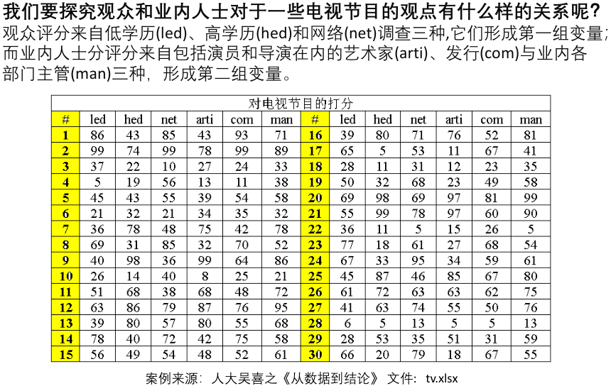
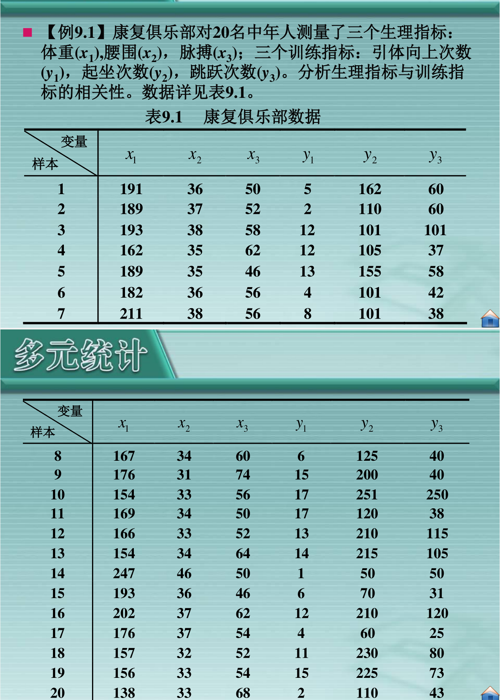

典型相关分析(Canonical Correlation Analysis)是一种多变量统计分析方法。它用于研究两组变量之间的线性相关性。具体来说，就是希望找到两组变量中各自的线性组合，使得两个线性组合之间的相关系数达到最大。

#### 导入

有这样一个案例：

如果我们直接对这些变量的相关性进行两两分析，很难能够得到关于这两组变量之间的关系的一个清楚的印象。

我们可以通过寻找一个代表来较为综合、全面地衡量所在组的内在规律。<u>一组变量最简单的综合形式就是该组变量的线性组合。</u>

#### 典型相关分析定义

典型相关分析由Hotelling提出，其基本思想和主成分分析很相似：

- 首先在每组变量中找出变量的线性组合，使得两组的线性组合之间具有最大的相关系数。

- 然后选取和最初挑选的这对线性组合不相关的线性组合，使其配对，并且选取相关系数最大的一对。

- 持续下去直到两组变量之间的相关性被提取完毕为止。

被提取出的线性组合配对被称为典型变量，其相关系数被称为典型相关系数。典型相关系数度量了这两组变量之间联系的强度。

数学思路：假设两组变量分别为:$X^{(1)}=(X^{(1)}_1,X^{(1)}_2,\cdots,X^{(1)}_p),X^{(2)}=(X^{(2)}_1,X^{(2)}_2,\cdots,X^{(2)}_q)$

分别在两组变量中选取若干代表性的综合变量$U_i、V_i$，使得每一个<u>综合变量是原变量的线性组合</u>，即

$$
U_i = a^{(i)}_1 X^{(1)}_1 + a^{(i)}_2 X^{(1)}_2 + \cdots + a^{(i)}_p X^{(1)}_p \triangleq \mathbf{a}^{(i)'} \mathbf{X}^{(1)}
$$

$$
V_i =b^{(i)}_1 X^{(2)}_1 + b^{(i)}_2 X^{(2)}_2 + \cdots + b^{(i)}_q X^{(2)}_q \triangleq \mathbf{b}^{(i)'} \mathbf{X}^{(2)}
$$

综合变量的组数是不确定的，如果第一组就能够代表原样本数据的大部分信息，那么一组就足够了。如果有第二组，那么为了让第二组的信息更加有效，还需要保证两组的信息不相关。即其协方差为0。

第一组所要满足的条件：在$var(U_1)=var(U_2)=1$满足的条件下，找到$a^{(1)}$和$b^{(1)}$两组系数，使得$\rho(U_1,V_1)$最大。

#### 典型相关分析一般流程

- 确定研究目标和数据收集：
  
  - 确定研究的变量。
  - 收集相关的数据并且形成数据矩阵。

- 计算协方差矩阵。（实际编码可以直接跳过这个部分）
  
  - 计算两组变量内部和两组变量之间的协方差矩阵。这些协方差矩阵反映了变量法内部和变量之间的<u>线性关系</u>。
  - ps：如果两个变量同时趋于增加或减少，则其协方差为正，反之则为负，组内的协方差矩阵对角线是各个变量自己的方差，而非对角线则是不同变量之间的协方差。两组变量之间的协方差则显示了两组变量之间的线性关系，如果第一组中的一个变量和第二组中的一个变量同时增加或减少，则其协方差为正。

- 计算$\hat A$和$\hat B$矩阵：
  
  - 利用协方差矩阵及其逆矩阵，来计算$\hat A$和$\hat B$矩阵，这些矩阵将被用于提取典型变量。

- 求解特征值和典型相关系数：
  
  - 求解特征方程，得到特征值。
  
  - 计算典型相关系数，这些系数量化了两组变量之间的相关性。在一般情况下，典型相关系数越接近1，表示两组变量的相关性就越强。
  
  - 以下图中的例题为例：我们从数据到相关系数，只需要：
    
    ```python
    import numpy as np
    from sklearn.cross_decomposition import CCA
    
    data = np.array([
        [191, 36, 50, 5, 162, 60],
        [189, 37, 52, 2, 110, 60],
        [193, 38, 58, 12, 101, 101],
        [162, 35, 62, 12, 105, 37],
        [189, 35, 46, 13, 155, 58],
        [182, 36, 56, 4, 101, 42],
        [211, 38, 56, 8, 101, 38],
        [167, 34, 60, 6, 125, 40],
        [176, 31, 74, 15, 200, 40],
        [154, 33, 56, 17, 251, 250],
        [169, 34, 50, 17, 120, 38],
        [166, 33, 52, 13, 210, 115],
        [154, 34, 64, 14, 215, 105],
        [247, 46, 50, 1, 50, 50],
        [193, 36, 46, 6, 70, 31],
        [202, 37, 62, 12, 210, 120],
        [176, 37, 54, 4, 60, 25],
        [157, 32, 52, 11, 230, 80],
        [156, 33, 54, 15, 225, 73],
        [138, 33, 68, 2, 110, 43]
    ])
    X = data[:, :3]
    Y = data[:, 3:]
    
    cca = CCA(n_components=3)
    cca.fit(X,Y)
    
    X_c, Y_c = cca.transform(X,Y)
    
    print("典型相关系数:", np.corrcoef(X_c.T, Y_c.T).diagonal(offset=3)
    ```
    
    输出如下：```典型相关系数: [0.79560815 0.20055604 0.07257029]```

- ~~进行典型相关系数显著性检验~~

在用完SPSS以后突然真香。这个部分似乎只需要学会使用SPSS进行分析并且能够分析结果就大差不差了。
