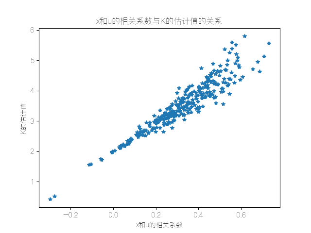

#### 多元回归分析的三个关键词

- 相关性
  
  - 需要注意的是，相关性$\neq$因果性。在大多数情况下没有办法探究严格的因果关系，只能够通过回归分析来研究相关关系。

- Y
  
  - 我们所熟知的因变量。因为别人的改变而改变的变量。在实际的应用中Y往往是我们需要研究的核心变量。
  
  - 一般而言我们所需要研究的Y有以下几种类型：
    
    - 连续数值型变量：是连续的。
    
    - 0-1型变量：结果只有两种情况，是二值型变量。
    
    - 定序变量：通过调查统计之类的分级得到的顺序型变量。
    
    - 计数变量：统计的次数之类的，是一个非负的整数。
    
    - 生存变量：不能够精确的观测的变量，只能够截断数据。一般是研究产品的寿命、企业寿命甚至是人的寿命。

- X
  
  - 我们所熟知的自变量，是一个用来解释Y的相关变量。

回归分析的任务就是，通过研究X和Y的相关关系，尝试去解释Y的形成机制，从而达到通过X去预测Y的目的。

#### 回归分析的使命

- 识别并判断。哪些X变量与Y真的相关，哪些不是。（实质上就是需要我们去进行变量选择）。

- 判别有用的X变量同Y的相关关系是正的还是负的。

- 在确定了重要的变量X的前提下，赋予不同X不同的权重，也就是不同的回归系数，进而我们可以得知不同变量之间的相对重要性。

#### 回归分析的分类

| 类型    | 模型             | Y的特点       | 例子         |
| ----- | -------------- | ---------- | ---------- |
| 线性回归  | OLS、GLS (最小二乘) | 连续数值型变量    | GDP、产量、收入  |
| 0-1回归 | logistic回归     | 二值变量（0-1）  | 是否生病、是否有病历 |
| 定序回归  | probit定序回归     | 定序变量       | 等级评定（优良差）  |
| 计数回归  | 泊松回归 (计数分布)    | 计数变量       | 每分钟车流量     |
| 生存回归  | Cox等比例风险回归     | 生存变量（截断数据） | 企业、产品的存命期  |

#### 数据的分类

- 横截面数据：在某一时点收集的不同对象的数据。
  
  - 采用多元线性回归处理。

- 时间序列数据：对同一对象在不同时间连续观察所取得的数据。
  
  - 采用移动平均、指数平滑、ARIMA、GARCH、VAR、协积处理。

- 面板数据：横截面数据与时间序列数据综合起来的一种数据资源。
  
  - 采用固定效应和随机效应、静态面板和动态面板处理。

#### 一元线性回归

设样本点为$(x_i,y_i),i=1,2,\cdots,n$，我们设置的拟合曲线为$y=kx+b$，求$k$和$b$，使得样本点和拟合曲线最接近。

设这些样本点为$(x_i,y_i),i=1,2,\cdots,n$，令拟合值$\hat{y_i}=kx_i+b$，那么$\hat{k}, \hat{b}= \underset{k,b}{arg\ min}(\sum\limits_{i=1}^{n}(y_i - \hat{y_i})^2)=\underset{k,b}{arg\ min(\sum\limits_{i=1}^n(y_i-kx_i-b)^2)} $

令$L={(\sum\limits_{i=1}^n(y_i-kx_i-b)^2)}$,现在要找$k,b$使得$L$最小。

- 一元线性回归模型
  
  假设$x$是自变量，$y$是因变量，且满足如下线性关系：$y_i=\beta_0 + \beta_1x_i+\mu$，其中$\beta_0$ 和$\beta_1$为回归系数，$\mu_1$为无法观测的且满足一定条件的干扰项。（其实和之前的拟合算法的内容一致）。
  
  令预测值 $\hat{y}_i = \beta_0 + \beta_1x_i$，其中 $\hat{\beta}_0, \hat{\beta}_1 =\underset{\beta_0,\beta_1}{arg\ min}(\sum\limits_{i=1}^{n}(y_i - \hat{y_i})^2)=\underset{\beta_0,\beta_1}{arg\ min(\sum\limits_{i=1}^n(y_i-\hat{\beta_1}x_i-\hat{\beta_0})^2)}$
  
  $\hat{\beta_0},\hat{\beta_1}=\underset{\beta_0,\beta_1}{arg\ min}(\sum\limits_{i=1}^n(\hat{\mu_i})^2)$我们称$\hat{\mu_i}=y_i-\hat{\beta_0}-\hat{\beta_1}x_i$为残差。

- 回归系数解释
  
  在原本没有考虑到新的变量时，模型的回归系数可能会没有那么准确。而在引入新的自变量之后，会对回归系数的影响非常大。原因是遗漏变量而导致的内生性。
  
  - 内生性
    
    假设模型为$y=\beta_0+\beta_1x_1+\beta_2x_2+\cdots+\beta_kx_k+\mu$，$\mu$为无法观测的且满足一定条件的扰动项。<u>如果满足误差项$\mu$和所有自变量 $x$均不相关</u>，则称该回归模型具有外生性。
    
    但是如果相关，则存在内生性，内生性会导致回归模型预测的不准确：不满足无偏和一致性。
    
    误差项$\mu$中包含所有与$y$相关，但是未添加到回归模型中的变量，如果这些变量和我们已经添加的自变量相关，则存在内生性。
  
  - 使用蒙特卡洛模拟验证内生性
    
    ```python
    import numpy as np
    import matplotlib.pyplot as plt
    
    times = 300
    
    R = np.zeros(times)
    K = np.zeros(times)
    
    for i in range(times):
        n = 30
        x1 = -10 + np.random.rand(n) * 20
        u1 = np.random.normal(0, 5, n) - np.random.rand(n)
        x2 = 0.3 * x1 + u1
        u = np.random.normal(0, 1, n)
        y = 2 * x1 + 5 * x2 + u + 0.5
        k = (n * np.sum(x1 * y) - np.sum(x1) * np.sum(y)) / (n * np.sum(x1 ** 2) - np.sum(x1) ** 2)
        K[i] = k
        u = 5*x2 + u
        r = np.corrcoef(x1, u)
        R[i] = r[0, 1]
    
    plt.plot(R, K, "*")
    plt.xlabel("x和u的相关系数")
    plt.ylabel("K的估计值")
    plt.title("x和u的相关系数与K的估计值的关系")
    plt.show()
    ```
    
    得到的结果如下：
    
    可以观察到在K的估计值为2的时候，x和u的相关系数为0。
  
  - 核心解释变量和控制变量
    
    无内生性要求所有解释变量与扰动项不相关，但是这个假定通常太强，因为需要我们解释的变量一般很多，并且还需要保证其全部外生。我们可以将其区分为核心解释变量和控制变量两类。
    
    - 核心解释变量：我们感兴趣的变量，由此也别希望得到对其系数的一致估计（当样本容量无限增大时，收敛于待估计参数的真值）。
    
    - 控制变量：我们没有那么感兴趣的变量，把他们放进回归方程仅仅是为了”控制住“那些对被解释的变量有影响的遗漏因素。
    
    在实际应用中，我们只需要保证核心解释变量与$\mu$不相关即可。
  
  - 取变量的时机
    
    经验法则：
    
    - 市场价值相关的，例如，价格、销售额、工资等都可以取对数。
    
    - 以年度量的变量，如受教育年限、工作经历等通常不取对数。
    
    - 比例变量，如失业率、参与率等，两者均可。
    
    - 变量取值必须是非负数，如果包含0，则可以对$y$取对数$ln(1+y)$。
    
    取对数的好处：
    
    - 减弱数据的异方差性。
    
    - 如果变量本身不符合正态分布，取了对数后可能渐近服从正态分布。
    
    - 模型形式的需要，让模型具有经济学意义。

#### 四类模型回归系数

| 模型     | 表达式              | 含义                             |
| ------ | ---------------- | ------------------------------ |
| 一元线性回归 | $y=a+bx+\mu$     | $x$每增加一个单位，$y$平均变化$b$个单位。      |
| 双对数模型  | $lny=a+blnx+\mu$ | $x$每增加$1\%$，$y$平均变化$b\%$。      |
| 半对数模型  | $y=a+blnx+\mu$   | $x$每增加$1\%$，$y$平均变化$b/100$个单位。 |
| 半对数模型  | $lny=a+bx+\mu$   | $x$每增加一个单位，$y$平均变化$(100b)\%$。  |

在有多个变量时，附加一句在其他变量不变时，$x$......$y$......

#### 特殊自变量

在自变量中如果有定性变量，如性别、地域等，我们需要把这些定性的变量转化为定量的变量。

- 虚拟变量（哑变量，dummy variables）：把定性的变量转化为定量的变量。
  
  虚拟变量前的回归系数解释：在其他自变量给定的情况下，定性变量变化所导致的差异。

- 多分类的虚拟变量设置：对于一个有$n$个类别的定性变量，需要创建$n-1$个哑变量。（为了避免所谓的“完全多重共线性”，不可以创建$n$个。）
  
  完全多重共线性：在一个线性回归模型中，一个或多个自变量可以通过其他自变量的线性组合精确预测。也就是说自变量中存在着完美的线性关系。
  
  - 估计系数的不确定性：当存在完全多重共线性时，线性回归模型中的参数估计将变得不确定，无法唯一确定。这是因为多重共线性导致的数据矩阵（设计矩阵）不可逆，或者说其行列式值为零，这使得无法通过标准的最小二乘法计算出唯一的参数估计值。
  
  - 统计推断的失效：完全多重共线性会使得模型的统计测试（如t检验）变得无效，因为你无法准确估计系数的标准误差，进而无法对系数的显著性进行有效的推断。

- 含有交互项的自变量：解释变量对一个因变量的偏效应、弹性或半弹性，有时很自然地取决于另一个解释变量的大小。
  
  - 比如：在一个回归模型中处理房屋价格（price）与房屋大小（sqrt）、卧室数量（bdrms）和浴室数量（bthrms）之间的关系：$\text{price} = \beta_0 + \beta_1 \text{sqrt} + \beta_2 \text{bdrms} + \beta_3 \text{sqrt} \cdot \text{bdrms} + \beta_4 \text{bthrms} + u$
    
    bdrms对price的偏效应为：$\frac{\Delta \text{price}}{\Delta \text{bdrms}} = \beta_2 + \beta_3 \text{sqrt}$。
    
    这里的交互项$$sqrt \times bdrms$被用来探索房屋大小与卧室数量如何联合影响房屋的价格。

#### 回归实例
