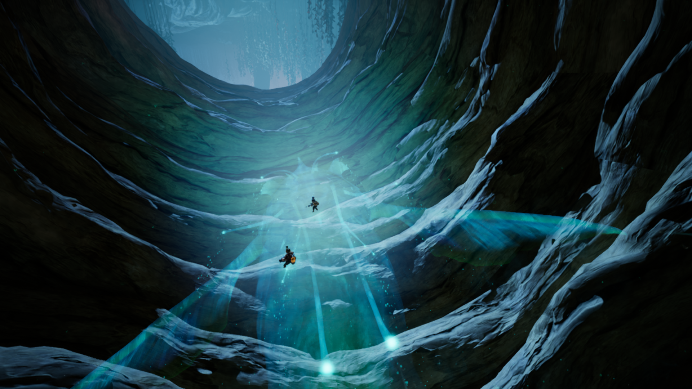
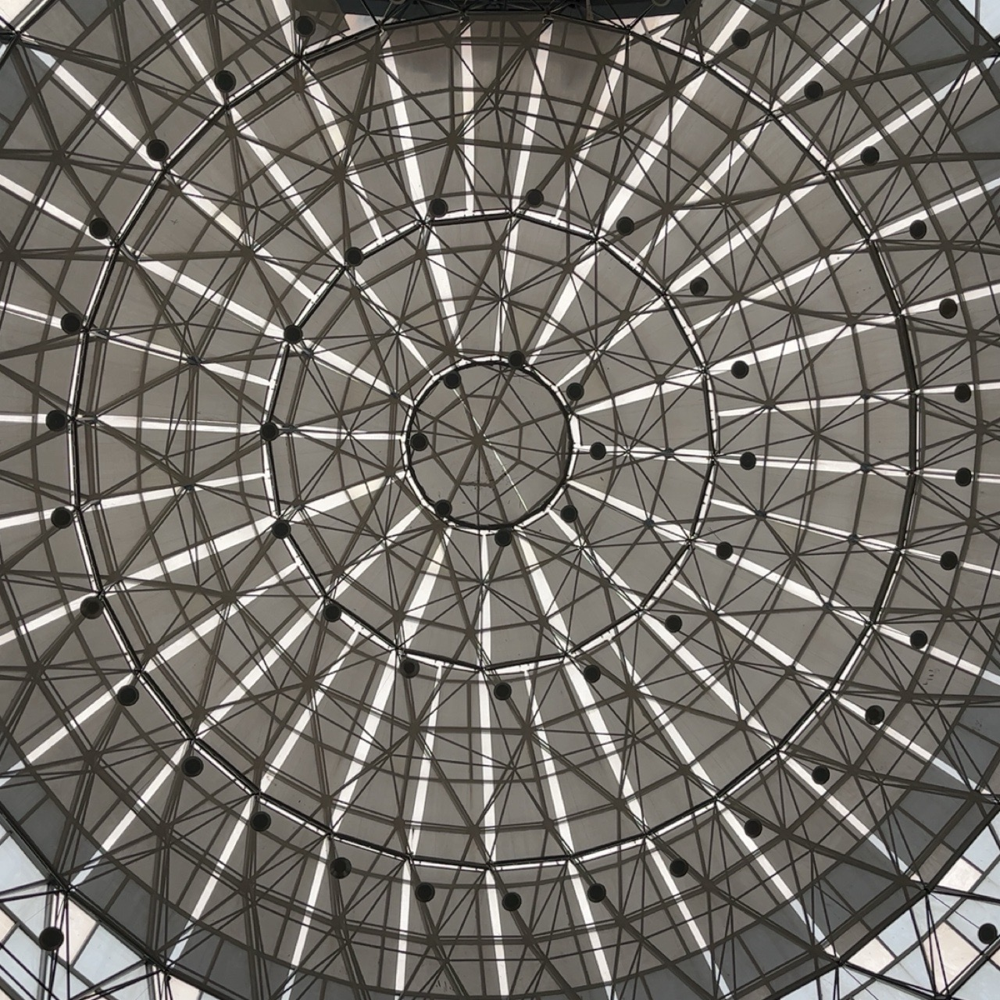
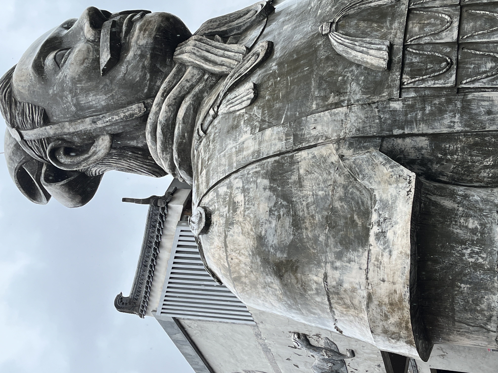

恍惚之间，又是一年。

感觉时间真是一个很无情的机器，在我还没有做好准备时候就已经无情地碾过。2023年，从开始到结束，似乎并没有太多给我喘息的时间。

其实本来是不太喜欢总结的，毕竟回想起已经过去的事情，总是会很容易让自己陷入当时的情境当中，然后陷入循环往复的内耗。至今自己还是一个会在深夜睡前突然想起以前做的很蠢的事情而感到自我尴尬然后开始胡思乱想的人，尽管2023有人对我说，其实没那么多人在意你，别给自己太多戏。是啊，其实没有那么多人会在意你做过的傻事。

### 一月

只记得当时阳了，整日没日没夜地躺在床上。幸运的是当时的身体还算得上不错，没有吃很多药，只在最难受的时候吃了一颗布洛芬，在经历了该有的阶段以后就痊愈了。值得幸运的也是，家里并没有人因为病毒而发生严重的事情。

新年在无聊中度过，不知道为什么，新年于我而言似乎已经越来越不重要了。也许是因为少了小时候的那种新年的气氛吧，自从20年之后就已经没有回过外婆家拜年了。

而后便是在去驾校的间隙读了三岛由纪夫。起初时是《春雪》，一本很让人难过的小说。虽然当时读完以后会觉得小说的剧情内容稍显俗套。男女的情情爱爱最终因为男方的懦弱而含恨，但是其实是一个特别变扭的人的扭曲的爱情故事。尽管在三岛由纪夫的笔触之下，叙事显得极尽哀婉和悲伤。但其实还是会让我想起以前的自己，是不是因为缺乏安全感而对别人百般试探，最终陷入质疑的无尽螺旋，直到陷入深渊。

但是在那之后我还是花时间把《丰饶之海》四部曲全部读完了。中间因为实在按耐不住于是去看了一些书评，结果被剧透了最终的结局，原来全都不过是一场空。

但是在读到下面这段话的时候，还是被物哀的美而感到深深震撼。

> 他既害怕看到美的废墟，
>
> 也害怕看到废墟上残留的美。

### 二月

和高中同学一起玩了《双人成行》，不得不说是一个很优秀的游戏。

玩到这里时发出了由衷的赞叹。

再之后喜欢往市图书馆跑，虽然图书馆的网速并不乐观，出门也意味着需要一段通勤时间。

喜欢在自习的间隙抬头看向穹顶。

再之后便是回到学校，在紧张的考试中结束了我的大一上学期。

### 三月与四月

在繁花盛开的时候去了植物园，看到了很好看的花。

在那之后还保持着对于新学期的新鲜感，上课也喜欢抢着前排坐。但是在后面的时候才觉得老师讲课并没有那么清楚，选择了自己一个人去图书馆自学。总感觉自己在寻找一个答案，但事实上其实我连问题是什么都不知道。

决定到处走走，去了都江堰。都江堰感觉是一个挺小的地方，走马观花看完了应该看的所谓景点。但其实就是换了一个地方走路，路上的景色并没有我所想的那样好看，只不过是想要换一个地方呼吸不一样的空气。

四月在学校闷了一个月，整天不知道在忙什么。但是现在回想起来自己似乎也只是奔走于教室与图书馆之间，完成自己应该做的课业任务而已。当时似乎还专门找了一些国外的课程进行学习，学习了CS61B，真的不得不感叹一番国外的大学教育。所有的内容都给你讲的一清二楚，绝无含糊之处。这种时候就很痛恨自己为什么没有好好学英语，挺多内容都不得不依靠于Google Translate。

四月份还发生了一件让我很难过的事情，我最喜欢的音乐家坂本龙一先生去世了。在初中的时候基本上睡前听的最后一曲都会是他的Merry Christmas Mr.Lawrence。高中的时候还专门做了一个演讲在班里介绍他，也曾很中二地把他的照片用来当作我的头像，至今的网名async也是源于他的倒数第二张专辑。

艺术千秋，人生朝露。

### 五月与六月

又再一次感染了新冠病毒。只是我太傻了，在检测为阳性以后就匆匆跟辅导员报告了，但是其实当时学校里面已经到处都是🐑了。当时还傻傻地一个人跑去另一个校区隔离了，幸运的是症状也就只有前两天比较严重，在退烧以后就基本上好了。

六月到了痛苦的期末月。因为宿舍里的别人半夜敲键盘导致有一段时间的睡眠及其差劲，于是跟他闹翻了。世界上就是会有那么多不懂得尊重别人的人，虽然我也用了及其难听的话语辱骂他。为了军训一天考了三个科目。在频繁翘课自学的这个学期，我的成绩仍然能够取得基本满绩。军训的过程很枯燥，每天训完以后回到宿舍就是打开DOTA2。

### 暑假

已经不太记得暑假是如何度过的了。回去赶上了高三的毕业典礼，跟高中同学混进了学校，但这个毕业典礼其实跟我并没有任何关系。再然后就是和高中同学一起烧烤，每个假期基本上都会组织一次这样的活动，希望以后的每个假期都可以一起玩呀。

高一时候的班主任让我组织以前的同学回去给学弟学妹们传授高考经验，也因为这个，跟好久没有联系的同学稍微联系了一下，其实大家都没怎么变呢。高考之后才是新的人生。不知道为什么，高中以前的想法却一直都是高考就是人生前十几年最重要的事情，也可能是因为这种想法，让自己在大学才这么被动吧。

但自己真的不喜欢周围的环境，周围的人。大家看起来都很忙碌，下了课以后就是陌生人。也可能是在这个地方找不到像高中那样跟我有能聊的来的人吧。

每天就是在看娃，~~学习~~以及去驾校中度过。

### 九月

不知道为什么，这个学期的开始便以一种学生的心态贯穿始终。每一节课都有去，但是课程却没有听得很明白，因为没有翘课所以也没有那么多时间去学习国外的课程。每节课基本上都有好好在上，但是听不懂了好像也没有怎么寻根究底。在重回校园的新鲜感中度过了第一个月。

### 十月

假期和高中同学在西安见了面。第一次一个人在火车上过夜。铁轨的声音和狭小的床铺让我难以入眠。基本上似睡非睡，只是在闭着眼睛度过了一夜。

西安是一座很不错的城市，有可爱的陕西话与深厚的历史底蕴，虽然也许是因为新鲜感。恰逢亚运会，在大雁塔前看了紧张刺激的DOTA2决赛。

也是基本上能逛的都逛了一圈。

假期结束以后感到了极大的反差，假期旅游的几天感觉就像是在梦里一样，而回来则要再面对我惨淡的现实。

十月底沉迷于DOTA2国际邀请赛。周末基本上都会熬夜看比赛，从一点多看到三四点，实在受不了了就睡觉。这样对身体并不是很友好，第二天早上基本上什么都做不了。下午又在犹豫要不要出门去图书馆，结局一般是在宿舍里面闷着。

宿舍这个环境其实真的不适合用来学习。因为受到周边的人的干扰极大，看到别人放松下来自己也就想要跟着放松，还是没有办法做到心无旁骛。但是那段时间又及其社恐，以至于根本不敢出门。

### 十一月

我喜欢上了一个女孩子。犹豫半个月才敢在年级群里添加别人的联系方式。

也许是完美主义在作祟，在没有真正认识别人之前，我都会很容易被别人的外表所迷惑，认为别人是一个几近完美的人。也就是主动给别人加上了一层滤镜，在大脑中无限地美化别人，于是把自己贬低。总是在幻想着想要寻找一个能跟自己一起努力的人，一起成为更好的人。但事实上是，其实只有自己变得更好了，才有能力去爱别人。没有自信的人终究会成为关系中弱势的一方，于是任人摆弄。

十一月，我重新开始跑步，在五月份再次感染之后重新开始频繁跑步，不出所料的是，身体机能确实大大下降了。但在两三周之后，我又能重新开始跑五公里了。

紧接而来的是降温。

### 十二月

综设项目匆匆忙忙，在代码和文档中度过了上旬。但紧接而来的便是考试。

在考完编译原理之后，我得出了一个很明确的结论，我不可能保研了。即便成绩在边缘线上。尽管我并没有缺席任何一节课，但是实际上也没有从课堂上学到太多东西。老师在上课的时候只顾着念他的PPT,在念完以后的一切，便都与他无关。回想起来，还不如自己翘课去找网课自学，这样至少还能学到点什么，而不是在念PPT的声音当中寻找自我安慰。

我又重新捡起了阅读的习惯。在复习的间隙，我读了《窄门》。

在读到某些片段的时候，感觉自己简直就是在照镜子。喜欢自己在脑子里面美化别人，其实喜欢的不过是追求完美的感觉，爱的不过是脑子里完美的别人，却不去爱自己。

读到某些片段的时候还是很震撼的，即使我并不认可。

> 我常常觉得，爱情是我拥有过最美妙的东西，我的所有美德都依附于它。 它让我腾空超越自己，但若没有你，我会再次跌至平庸之地， 回到极寻常的秉性中去。因为抱着与你重逢的期待， 在我眼里最险峻的小道也总是最好的。

### 小结

其实从头写到尾，三千字看下来简直就像流水账一样。不过这也从侧面印证了我自己的想法：我似乎已经不再擅长于用很大的篇幅来表达自己。所以在这个追求短平快的时代，我还是想要通过博客来表达自己，一方面是一种锻炼，另一方面也是一种记录。

即便很大概率不会被很多人看到，但我还是写了下来，希望以后自己看的时候能够有所思有所悟。

2024,希望你活得更快乐一点，更有意义一点。
